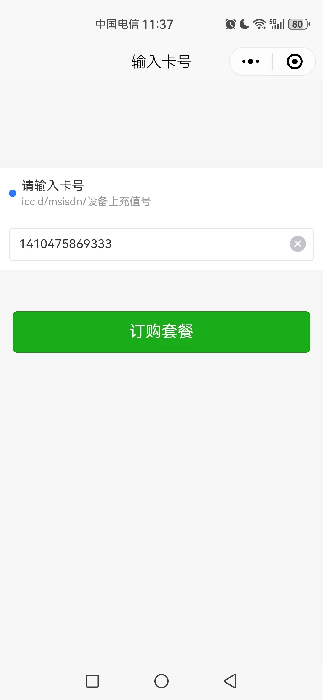
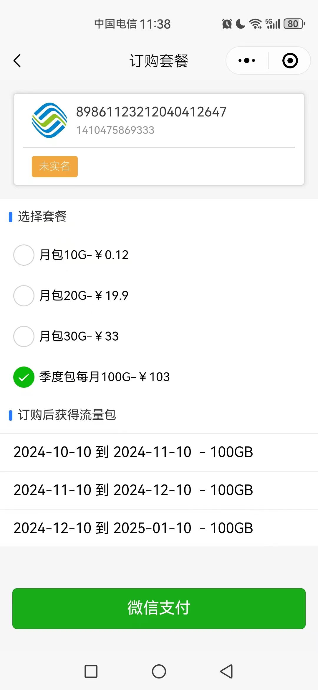
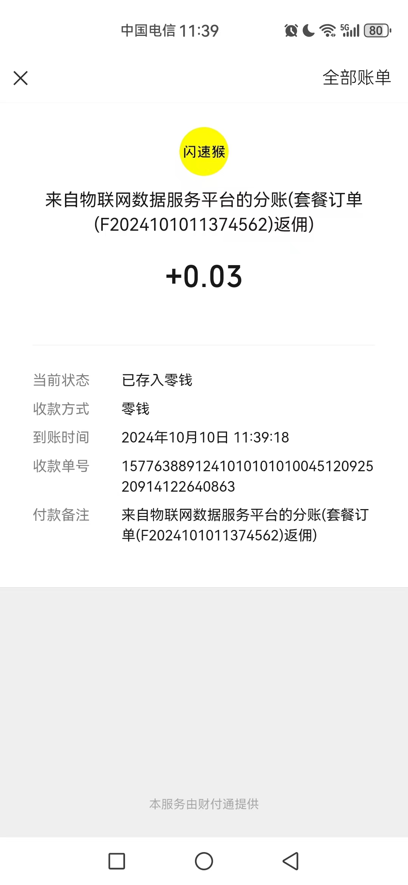

# simctl

#### 介绍
物联卡管理系统主要功能
- 支持三大运营商API对接,流量和状态同步；
- sim卡导入，设置套餐，分配代理
- 套餐：月/天套餐定义，微信小程序订购套餐；
- 代理：代理层级不限，套餐结算价设置，订单分佣使用微信分账；

#### 软件架构
采用Golang 1.22.1  Chi框架+xorm

#### 目录结构
model/ 模型层代码

#### 前端概览
|  |  |  |
|----|----|----|

#### 套餐订购模块

路径 /controller/order.go

前后端采用websocket通信,我们来看看这个struct

```
type Buy struct {
	widget
	user      *model.User
	saleMeals []*model.SaleMeal
	order     *model.Order
	prepay    *jsapi.PrepayWithRequestPaymentResponse
}
```
首选 saleMeals 可销售套餐
订单未支付前不会保存到数据库,先计算出流量包对象显示，保存


联系开发者 微信号 wuzhiqiang-dev


